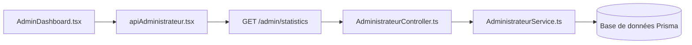

# Plan d'implémentation: Statistiques dynamiques Admin

## 📋 Objectif
Remplacer toutes les valeurs statiques du tableau de bord administrateur par des données réelles venant de la base de données.

---

## 🔢 Indicateurs à dynamiser

| Widget | Valeur actuelle | Source de données |
|--------|-----------------|-------------------|
| Total utilisateurs | 156 | `SELECT COUNT(*) FROM Utilisateur` |
| Total formations | 24 | `SELECT COUNT(*) FROM Formation` |
| Formateurs actifs | 12 | `SELECT COUNT(*) FROM Utilisateur WHERE role = 'PROF'` |
| Apprenants | 140 | `SELECT COUNT(*) FROM Utilisateur WHERE role = 'APPRENANT'` |
| Revenus totaux | 12 450 € | `SELECT SUM(montant) FROM Paiement WHERE statut = 'VALIDÉ'` |
| Formations en attente | 3 | `SELECT COUNT(*) FROM Formation WHERE statut = 'EN_ATTENTE'` |
| Taux de complétion | 68% | Calcul sur la table Progression |

---

## 📊 Graphiques à dynamiser

1. **Inscriptions par mois**
   - 12 derniers mois
   - Nombre d'inscriptions par mois

2. **Formations populaires**
   - Top 5 formations avec le plus d'inscrits

3. **Évolution des utilisateurs**
   - Courbe de croissance des utilisateurs sur 6 mois

4. **Répartition par catégorie**
   - Nombre de formations par catégorie

---

## 🛠️ Architecture technique

---

## 📑 Étapes d'implémentation

1. **Backend**:
   - Créer la méthode `getStatistics()` dans `AdministrateurService`
   - Ajouter la route `GET /admin/statistics` dans le contrôleur
   - Implémenter toutes les requêtes SQL avec Prisma
   - Retourner un objet standardisé avec tous les indicateurs

2. **Frontend**:
   - Ajouter la fonction `getStatistics()` dans `apiAdministrateur.tsx`
   - Ajouter les états dans AdminDashboard pour stocker les statistiques
   - Remplacer chaque valeur statique par la valeur dynamique
   - Ajouter un état de chargement
   - Ajouter un rafraichissement automatique toutes les 30 secondes

---

## ✅ Résultat attendu

Tous les chiffres et graphiques du tableau de bord administrateur se mettent à jour automatiquement en temps réel sans avoir besoin de rafraichir la page.
